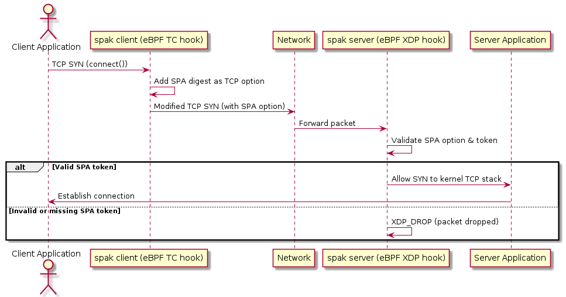

# spak

**spak** stands for **Single Packet Authentication with eBPF**. It is an experimental project that explores two things at once: how eBPF can be used to modify live network packets at the kernel level, and a new way to do port authentication that is faster and leaner than existing approaches.

---

## The idea

Most servers expose their services to the internet and rely on passwords, TLS, or firewalls to keep unwanted connections out. The problem is that by the time the kernel even hands a connection to your application, a lot of work has already happened — TCP handshake, socket allocation, scheduler wakeup. For high-traffic servers or servers under attack, this adds up.

A technique called **Single Packet Authentication (SPA)** tries to solve this by requiring a client to prove it knows a shared secret *before* the server lets any TCP connection through. The server runs a firewall that drops everything by default. A client that wants to connect first sends a specially crafted packet — typically a UDP datagram — containing a cryptographic token. The server verifies the token and temporarily opens the port for that client's IP.

This project takes that concept and pushes it one step further.

---

## What makes this different

### Port knocking vs. SPA

Port knocking is the older technique. The client "knocks" on a sequence of closed ports in a specific order, and the server watches for that sequence and opens a port. It is simple but fragile — the sequence is observable, replayable, and there is no real cryptographic guarantee.

SPA replaces the sequence with a single packet containing a cryptographic token (a MAC over a timestamp, the client's IP, and a shared secret). Because the token is time-bound and one-use, it cannot be replayed. 

### How existing SPA works vs. how this project works

Every SPA implementation the author is aware of works the same way at the protocol level:

1. Client sends an authentication packet (usually UDP) to the server.
2. Server verifies the token and opens the firewall for that source IP for a short window.
3. Client then initiates a normal TCP connection inside that window.

This means two round-trip phases. The auth packet and the actual connection are separate. There is a timing window between them, and the client needs extra tooling to send the auth packet.




**spak does it in one step.** Instead of sending a separate auth packet, the client embeds the authentication token directly inside the TCP SYN packet as a TCP option. The server inspects that option before deciding whether to let the SYN through. There is no timing window, no extra packet, and no separate auth phase — the handshake either succeeds or is dropped at XDP, before it ever touches the kernel's TCP stack.

---

## How eBPF makes this possible

This is also a demonstration of what eBPF can do to packets in flight.

**On the client side**, an eBPF program is attached to the TC (Traffic Control) egress hook. Every outgoing TCP SYN packet passes through it. The program:
- Grows the packet's tail to make room for a new TCP option
- Shifts existing options forward
- Writes the SPA option (kind 253, the experimental TCP option number defined in RFC 6994) into the space it created
- Recomputes the TCP checksum and IP total length in-place

All of this happens in the kernel, transparently, without the application knowing anything about it. A normal `connect()` call from any program will automatically get the SPA option injected.

**On the server side**, an eBPF XDP program runs at the earliest possible point — before the kernel even allocates a socket. For every incoming TCP SYN:
- It checks whether the destination (IP + port) is protected
- If it is, it looks for the SPA TCP option (kind 253) in the SYN's option list
- It computes the expected SipHash and compares it to the tag in the option
- If verification fails, the packet is dropped with `XDP_DROP` — the kernel's TCP stack never sees it

Non-SYN packets are passed through normally. Once a connection is established (the SYN was accepted), subsequent packets reach the application as usual.

---

## The TCP option structure

TCP options are a standard extension mechanism. Each option has a `kind` byte, a `len` byte, and then its data. Kind 253 and 254 are reserved for experiments by [RFC 6994](https://datatracker.ietf.org/doc/html/rfc6994), which also defines the `ExID` field to disambiguate experiments.

The SPA option used in this project looks like this:

```
 0               1               2               3
 0 1 2 3 4 5 6 7 0 1 2 3 4 5 6 7 0 1 2 3 4 5 6 7 0 1 2 3 4 5 6 7
+-+-+-+-+-+-+-+-+-+-+-+-+-+-+-+-+-+-+-+-+-+-+-+-+-+-+-+-+-+-+-+-+
|   Kind (253)  |  Length (20)  |       ExID (2 bytes)          |
+-+-+-+-+-+-+-+-+-+-+-+-+-+-+-+-+-+-+-+-+-+-+-+-+-+-+-+-+-+-+-+-+
|   Version (1B)|  Reserved (1B)|       Key ID (2 bytes)        |
+-+-+-+-+-+-+-+-+-+-+-+-+-+-+-+-+-+-+-+-+-+-+-+-+-+-+-+-+-+-+-+-+
|                      Time Step (4 bytes)                      |
+-+-+-+-+-+-+-+-+-+-+-+-+-+-+-+-+-+-+-+-+-+-+-+-+-+-+-+-+-+-+-+-+
|                    SipHash Tag (8 bytes)                      |
|                                                               |
+-+-+-+-+-+-+-+-+-+-+-+-+-+-+-+-+-+-+-+-+-+-+-+-+-+-+-+-+-+-+-+-+
```

- **Kind 253** — experimental TCP option
- **ExID** — identifies this specific experiment
- **Key ID** — selects which pre-shared key to use (allows key rotation)
- **Time Step** — coarse timestamp for replay prevention
- **Tag** — 8-byte SipHash-2-4 output over (ExID, version, key_id, time_step, TCP sequence number)

The TCP sequence number (ISN) is included in the hash input so the tag is tied to this specific connection, not reusable in another.

---

## Why SipHash

The authentication tag is computed with **SipHash-2-4**, a fast keyed hash function designed by Jean-Philippe Aumasson and Daniel J. Bernstein ([paper](https://www.aumasson.jp/siphash/siphash.pdf)).

SipHash was built specifically for short, variable-length inputs — exactly the kind of thing this project hashes (a ~14-byte struct). It is used in hash table implementations inside the Linux kernel and the Rust standard library, among others, because it offers a good balance: fast enough to run on every packet, and secure enough to prevent MAC forgery without a full HMAC construction. Running it inside an XDP or TC eBPF program adds essentially no measurable latency.

---

## Building

### Prerequisites

- Linux kernel — only tested on 6.2.0; no idea how the BPF verifier behaves on older kernels or with different Clang versions, so your mileage may vary
- Clang/LLVM 14+
- Rust (stable)
- `bpftool`

### Build the BPF programs

```bash
cd kern
make
```

Output goes to `kern/.output/`.

### Build the userspace programs

```bash
cargo build
```

---

## Running

### Server

Load the XDP program on the interface and populate the maps:

```bash
sudo ./target/debug/spak-server
```

The server attaches to `lo` by default. Edit `spak-server/src/main.rs` to change the interface and the protected destinations/keys before building.

### Client

Load the TC egress program:

```bash
sudo ./target/debug/spak-client
```

After this, any outgoing TCP SYN to a destination listed in the client's `secrets` map will automatically carry the SPA option.

---

## Status

This is experimental work-in-progress. The core packet injection and verification paths work. Things that are still rough:

- The server currently only attaches to `lo`; interface selection is hardcoded
- Replay prevention via `time_step` is not yet enforced on the server
- The `legitimate_flows` map is populated but not yet used to gate non-SYN packets
- No key exchange mechanism; keys are hardcoded at startup

---

## License

See [LICENSE](LICENSE).
